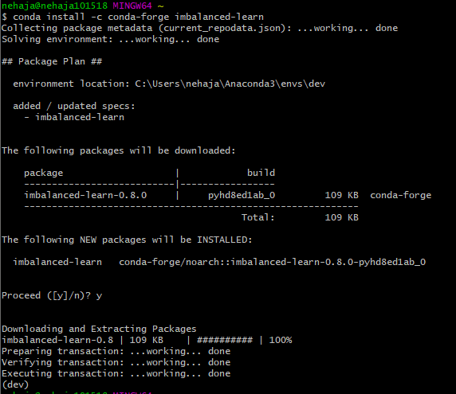
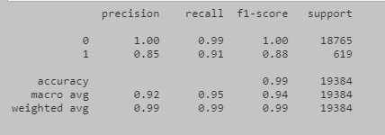
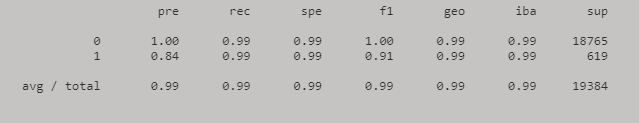

# FinTech-Module-12-Challenge
## Application:
Credit risk poses a classification problem that’s inherently imbalanced. This is because healthy loans easily outnumber risky loans. In this Challenge, you’ll use various techniques to train and evaluate models with imbalanced classes. You’ll use a dataset of historical lending activity from a peer-to-peer lending services company to build a model that can identify the creditworthiness of borrowers.

---
## Technologies

In this challenge, you’ll use [Jupyter Lab](https://jupyterlab.readthedocs.io/en/stable/) and the following  **[python version 3.8.5](https://www.python.org/downloads/)** libraries:


* [pandas](https://pandas.pydata.org/docs/)

* [scikit-learn](https://scikit-learn.org/stable/)
    * [scikit metrics](https://scikit-learn.org/stable/modules/model_evaluation.html) 
    *  [imbalanced-learn](https://imbalanced-learn.org/stable/) 
    *  [linear model](https://scikit-learn.org/stable/modules/linear_model.html)
---
## Installation Guide


  ### To check that scikit-learn and hvPlot are installed in your Conda dev environment, complete the following steps:

  ### 1. Activate your Conda dev environment (if it isn’t already) by running the following in your terminal:
```
conda activate dev
```
### 2. When the environment is active, run the following in your terminal to check if the scikit-learn and imbalance-learn libraries are installed on your machine:
```
conda list scikit-learn
conda list imbalanced-learn
```
### If you see scikit-learn and imbalance-learn listed in the terminal, you’re all set!

  ### 1. Install scikit-learn
```
pip install -U scikit-learn
```
### 2. Install imbalance-learn
```
 conda install -c conda-forge imbalanced-learn
```

---
## Usage

To use this application, simply clone the repository and open jupyter lab from git bash by running the following command:

```python
jupyter lab
```


---
## Examples:
In this application, these are the analysis reports using original data and oversampled data:
* Classification Report for original data using Logistic Regression model:


* Classification of data using Oversampled data:

---

## Contributors

Brought to you by Neha Jantre.

---

## License

MIT